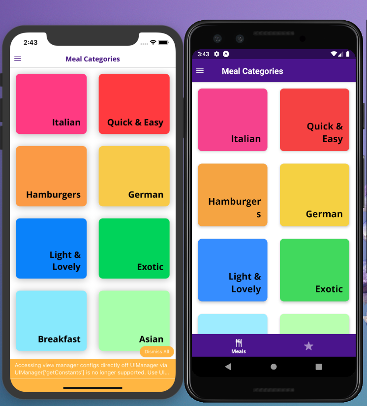
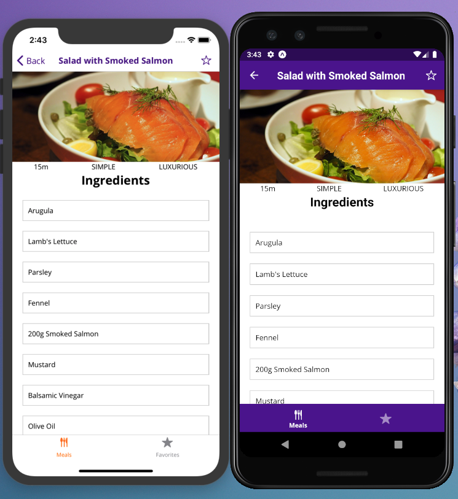
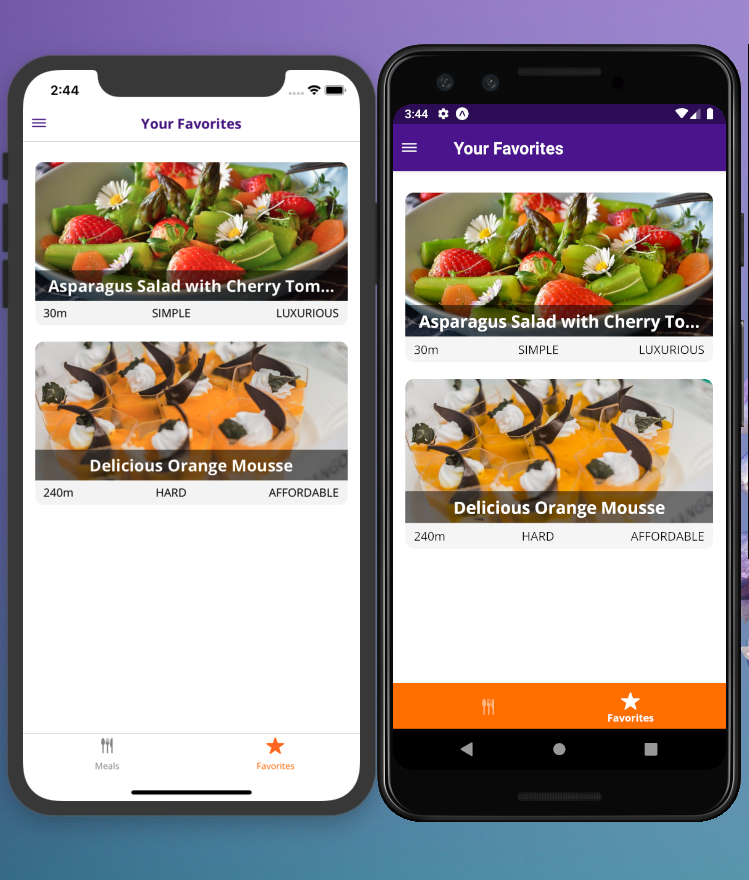
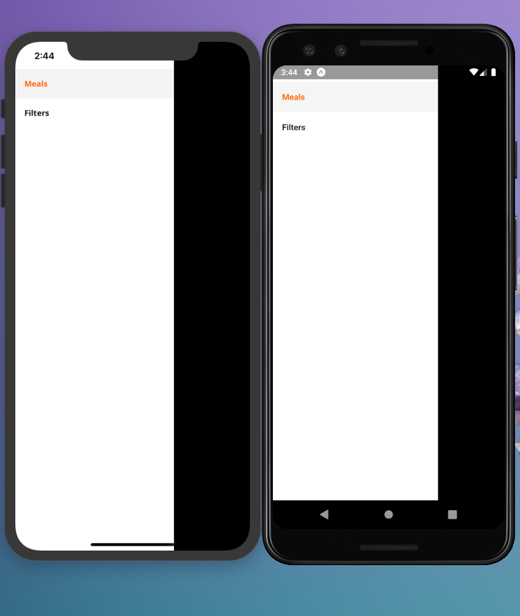
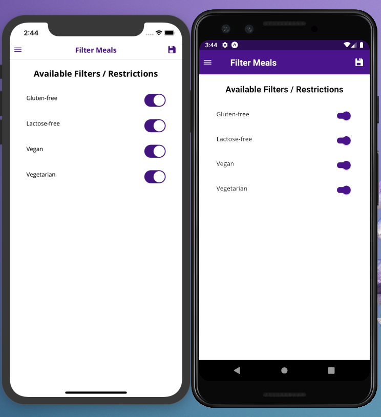

# Meals App

A new  React Native application.

## React Native Udemy cours

React Native - The Practical Guide 2020
Use React Native and your React knowledge and take your web development skills to build native iOS and Android Apps

These resources might also be helpful:

Dimensions API - Official Docs: https://facebook.github.io/react-native/docs/dimensions#docsNav

Platform-specific Code - Official Docs: https://facebook.github.io/react-native/docs/platform-specific-code

React Navigation Docs: https://reactnavigation.org/docs/en/getting-started.html

Official Redux Docs: https://redux.js.org/introduction/getting-started

React Redux Docs: https://react-redux.js.org/

